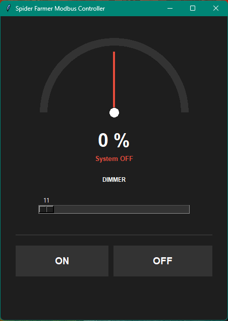
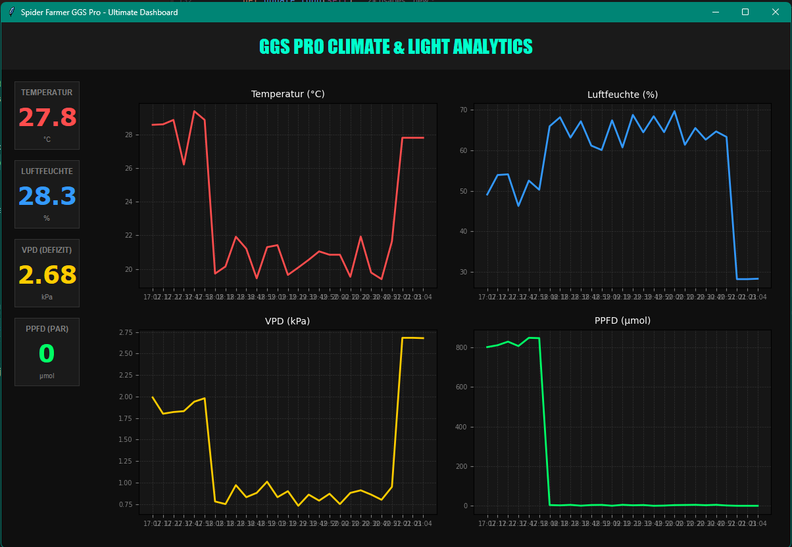
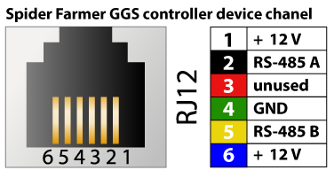

# 💡 Spider Farmer Modbus Controller & Analytics

Eine unabhängige Python-Suite zur präzisen Steuerung von Spider Farmer LED-Lampen 
und zur Echtzeit-Analyse des Zeltklimas 
(GGS Pro Sensor) über das Modbus RTU Protokoll.

---
### Getestet mit:

- Lampe: SE-1500
- Sensor: Spider Farmer GGS Sensor Pro

⚠️ Andere Versionen nicht bekannt oder getestet ⚠️

---

## ⚠️ Wichtiger Hinweis (Disclaimer)

**Dieses Programm ist KEIN offizielles Produkt von Spider Farmer®.**  
Es handelt sich um eine unabhängige Entwicklung (Community-Projekt).
Es besteht keine Verbindung, Autorisierung oder Unterstützung durch die Spider Farmer Company.

**Haftungsausschluss:** Die Verwendung dieses Skripts und der Hardware-Eingriff erfolgen auf eigene Gefahr. 
Es wird keine Haftung für Schäden an der Lampe, dem Controller oder angeschlossener 
Hardware übernommen. Durch unsachgemäße Verkabelung oder Modifikation kann die Herstellergarantie 
erlöschen.

---

## 🚀 Neu: Analytics Dashboard (GGS Pro)



- **Echtzeit-Steuerung:** Sofortige Übermittlung von Dimm-Befehlen beim Bewegen des Sliders.
- **Visuelles Feedback:** Interaktives Tachometer (Gauge) zur Anzeige der aktuellen Leistung.
- **Dark Mode Design:** Augenschonende, moderne GUI für den Einsatz in Arbeitsumgebungen.
- **Heartbeat-Funktion:** Automatisches Senden des Payloads im 1-Sekunden-Intervall zur Stabilisierung der Verbindung.
- **Sicherheits-Logik:** Automatisches Einschalten bei Dimmung > 0% und Einhaltung eines Mindest-Zündwerts (11%).



- 4-Kanal-Visualisierung: Gleichzeitige Anzeige von Temperatur, Luftfeuchtigkeit, VPD und PPFD.
- Echtzeit-Charts: Historische Verläufe der letzten 30 Messungen in einer 2x2 Matrix.
- VPD-Indikator: Automatische Berechnung des Dampfdruckdefizits zur Vermeidung von Pflanzenstress.
- Automatisches Logging: Alle Messwerte werden im Sekundentakt (einstellbar) in /logs/sensor_log.csv und demo_log.csv gespeichert.
- Smart-Start: Lädt beim Öffnen automatisch die letzten Daten aus der Demo-Datei, um sofortige Kurven anzuzeigen.

---

## 🛠 Hardware-Voraussetzungen

### Modbus an SE&G Series
1.  **Modus:** Die Lampe muss am physischen Controller auf **'Linked'** gestellt werden.
2.  **Adapter:** Ein **USB-zu-RS485** Konverter/Dongle.
3.  **Verkabelung (RJ12):**
    *   **Pin 3:** RS485-A (Data+) — *Meist Farbe Rot*
    *   **Pin 6:** RS485-B (Data-) — *Meist Farbe Blau*

### Modbus an GGS Pro Sensor Series
1. **Adapter:** Ein **USB-zu-RS485** Konverter/Dongle.
2.  **Verkabelung (RJ12):**
    *   **Pin 2:** RS485-A (Data+) — *Meist Farbe Schwarz*
    *   **Pin 5:** RS485-B (Data-) — *Meist Farbe Gelb*
    

---

## 📋 Installation

1. **Python installieren:** Stelle sicher, dass Python 3.x installiert ist.
2. **Abhängigkeiten installieren:**
   ```bash
   pip install pyserial
   
3. **Konfiguration:** Öffne die SpiderFarmerControl.py und passe den SERIAL_PORT 
(z.B. COM10) sowie die LAMPE_MAC an.

## 📋 Bedienung
Slider: Regelt die Helligkeit. Sobald der Regler bewegt wird, schaltet die Lampe ein.

ON Button: Schaltet die Lampe auf den letzten eingestellten Wert (mindestens jedoch 11%).

OFF Button: Sendet den Power-Status 0 und Dimmer 0.

Tachometer: Visualisiert den aktuellen Output-Status der Lampe.

Entwickelt für die Community. Grow safe! 🌿
Die Möglichkeit der Steuerung über Modbus-RTU
macht deine Spider noch großartiger.